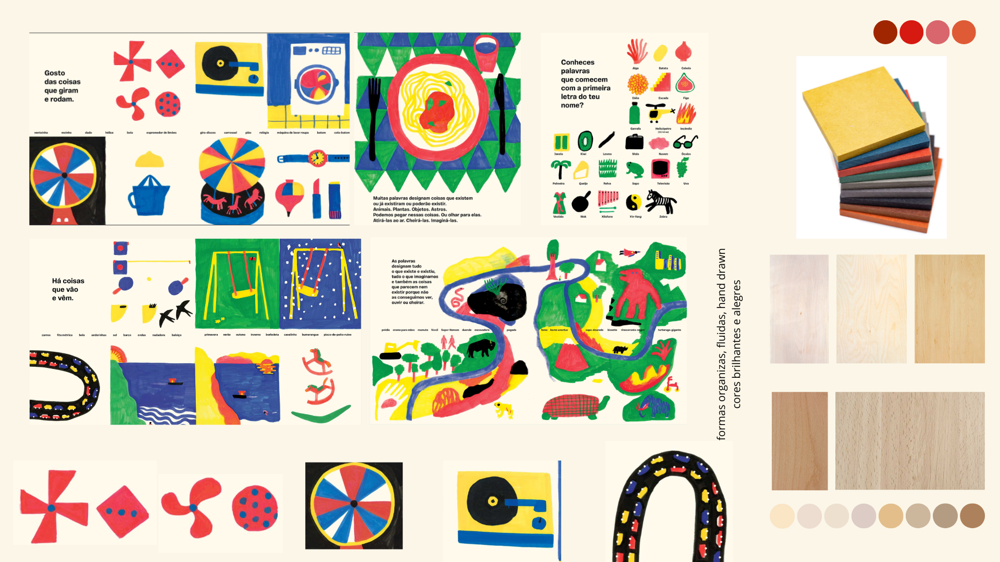

# Contexto de Design

Página explicativa do contexto, em concordância com a apresentação produzida em grupo. Componente de **grupo**.

## 1. Resumo / Abstract

> Máximo 500 palavras. Preferencialmente em **PT** e **EN**.

### Resumo (PT)

O projeto Nestor consiste no desenho de brinquedos projetados para serem cortados numa CNC a partir dos desperdícios de madeira de fábricas de mobiliário. Os objetos seriam cortados a partir de restos do corte de peças de mobília com o objetivo de reduzir o desperdício de madeira criado por esta indústria. 

Como resposta ao enunciado foram criados quatro brinquedos distintos: um jogo de equilíbrio, uma torre inspirada num percurso de berlindes, um avião de brincar e uma casa de bonecas baseada num moinho de água. Os objetos foram concebidos para públicos alvo de idades diferentes, mas mantém as cores e os materiais como pontos em comum: o Valchromat de cor vermelha e as madeiras de faia e vidoeiro. 

### Abstract (EN)

Project Nestor is an initiative for the design of toys to be cut in a CNC machine from the scraps of wood from furniture factories. Those objects would be cut from the scraps leftover from cutting the components of the furniture pieces to help reduce the wood waste caused by this industry.

As a response to the challenge, four different toys were created: a balance game, a tower inspired by an obstacle course for marbles, a toy plane and a dollhouse based on a water mill. The objects were designed for different target audiences, but they converge when it comes to colours and materials to mantain consistency: red Valchromat and the woods of beech and birch.

## 2. Referências Coletivas

### 2.1. Recolha de Objetos a Redesenhar/Remisturar

Catálogo de objetos de partida que o grupo identificou para o redesenho. Para cada objeto: imagem, origem, motivo da escolha.

- **Objeto 1** — origem / autoria / razão da escolha
- **Objeto 2** — ...

### 2.2. Moodboard

Painel de referências visuais e conceptuais que orientam a estratégia do grupo.

