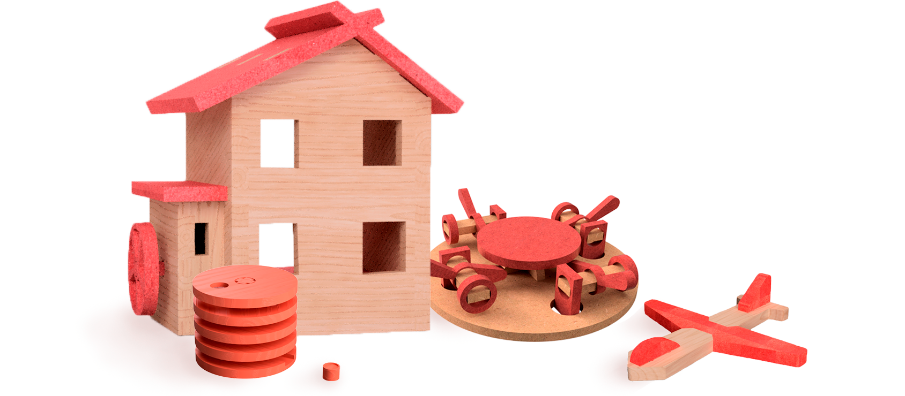
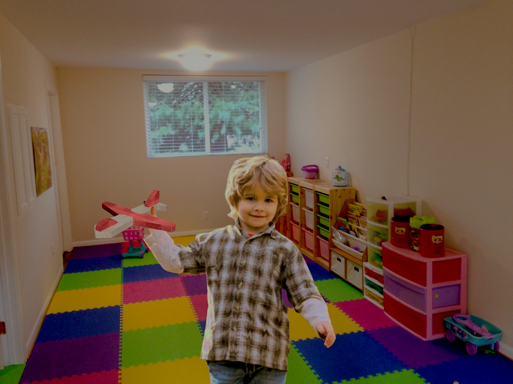
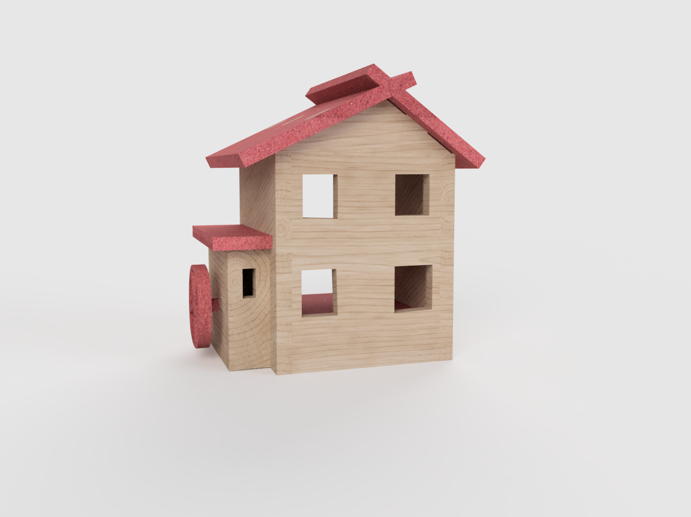
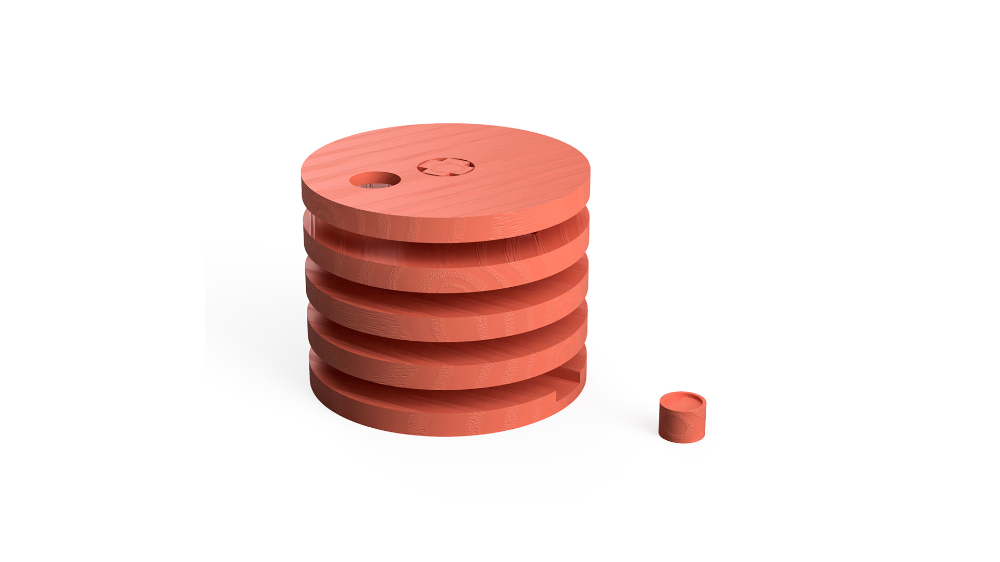

# Nestor: Movimenta a Imaginação

> Substituam este parágrafo por uma frase de apresentação do grupo (uma linha, conceptualmente forte). A imagem de capa acima (`attachments/hero.jpg`) deve ser uma **fotografia de conjunto** dos trabalhos do grupo, mais conceptual, que espelhe a estratégia coletiva.
> Movimenta a imaginação: para todas as crianças que gostam de brincar (substituir por uma melhor)
> 

## Elementos do Grupo

| Número  | Nome           |
| ------- | -------------- |
| 2024338 | Marisa Filipe  |
| 2024311 | Maria Carrilho |
| 2024295 | Rafael Marques |
| 2023223 | Rui Bailão     |

---

## Contexto de Design

> Os quatro brinquedos desenhados pelo grupo têm como ponto comum as cores e os materiais. Apesar de terem sido desenhados para vários tipos de brincadeiras diferentes, a coerência visual proveniente deste aspeto identifica-os como objetos da mesma marca ou coleção

Resumo, referências coletivas e moodboard do grupo encontram-se em [contexto.md](contexto.md).

[Ver contexto completo →](contexto.md)

---

## Galeria de Produtos

<!-- Cada thumbnail liga à página individual de cada produto.
     Cada produto vive em produtos/<numero>-<nome>/index.md
     e tem uma sub-página produtos/<numero>-<nome>/processo.md -->

<!-- markdownlint-disable MD033 -->

  <!-- duplicar o bloco abaixo para cada produto do grupo -->

  <a class="gallery-card" href="produtos/marisa/">
    
    <h3>Harmonia em Movimento</h3>
    
Marisa Filipe

  </a>
  <a class="gallery-card" href="produtos/rafael/">
    
    <h3>Avião</h3>
    
Rafael Marques

  </a>
  <a class="gallery-card" href="produtos/rui/">
    
    <h3>Moinho de Água: Casa de Bonecas</h3>
    
Rita Bailão

  </a>
  <a class="gallery-card" href="produtos/maria/">
    
    <h3>Torre Labirinto</h3>
    
Maria Carrilho

  </a>

  <!-- duplicar o bloco acima para cada produto do grupo  e substituir _modelo em ambas por <numero>-<nome> -->

<!-- markdownlint-enable MD033 -->
