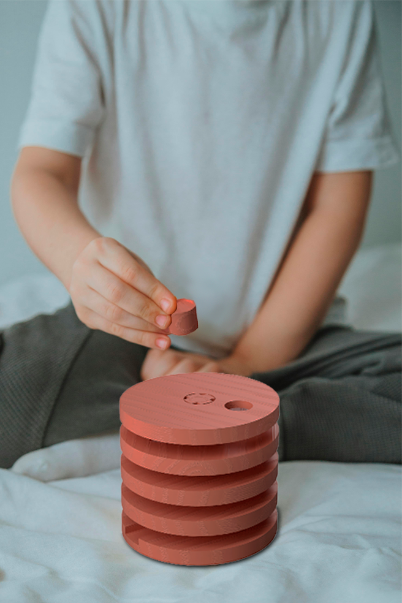
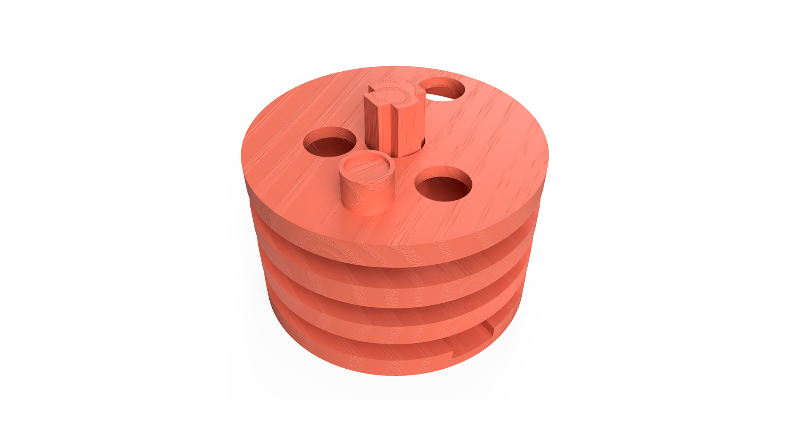
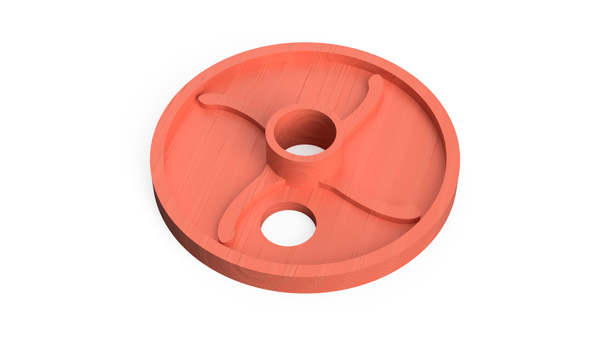
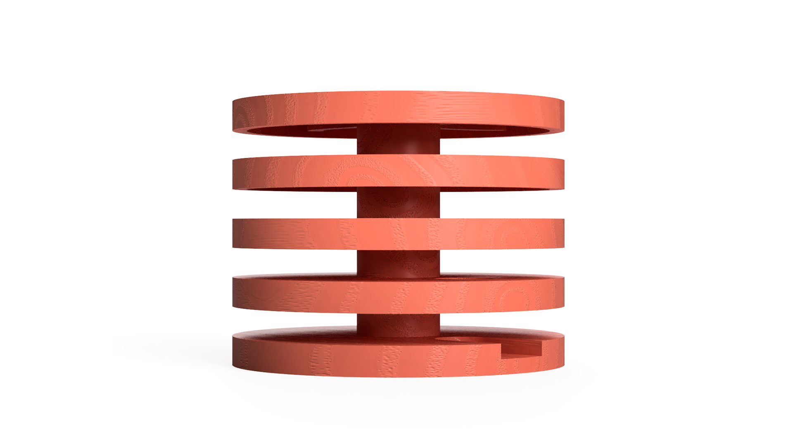

# Torre Labirinto

> Um puzzle espera por ti lá dentro! Navega o disco entre as camadas para chegares ao fim!

## Conceito

A torre labirinto foi criada com o propósito de ser um puzzle estratégico para os mais pequenos através da interação da criança ao girar as camadas para navegar o disco até ao final. Este brinquedo oferece à criança habilidades de resolução de problemas e pensamento critico perante desafios que destinam-se ao impedimento do sentido da visão.

Pensado para idades entre os 5 e 9 anos.

## Enquadramento

Posicionamento em relação ao contexto de grupo (ver [contexto](../../contexto.md)) e à recolha de objetos a redesenhar.

O conceito da marca Nestor, desenvolvida paralelemente no módulo de Design de Comunicação e Interação, apoia-se nas 'ideias' da imaginação, movimento e formas simples de fácil reconhecimento. Então, com este brinquedo exploro o conceito do movimento como brincadeira traduzida para um jogo estratégico.

## Tecnologia

- Materiais: Valchromat (vermelho), Faia, Vidoeiro
- Fabricado em máquina de corte CNC
- Software paramétrico utilizado: Fusion 360 
- Modelo 3D: https://a360.co/4dMnO5w
- Ficheiros:

## Função

##### Descrição geral
A torre labirinto é constituída por camadas sobrepostas, onde cada tem uma tem um número variado de buracos e de pás de ventoinha. Esse número diminui conforme se chega ao fim.
##### Como se brinca?
Para começar, insere-se o disco na primeira camada e para o mover entre o labirinto basta girar a camada de cima do mesmo! As pás de ventoinha carregam o disco na sua aventura.
##### Idade-alvo
Pensado para idades entre os 5 e 9 anos.

##### Montagem
A torre labirinto tem uma montagem fácil e intuitiva. 
Posiciona-se a base numa superfície plana com a cavidade para cima. Encaixasse as duas peças que formam o eixo central e inserem-se na base. Após a base e o eixo estarem fixos, colocasse as camadas da torre, começando com a que tem menos números de pás de ventoinhas para a maior. A camada superior deve ser a com mais pás mas só um buraco.

##### Diretiva 2009/48/CE
Este brinquedo segue várias diretrizes importantes de segurança: 

- Foi desenhado e fabricado para ser totalmente seguro durante o uso normal. 
- É livre de qualquer substância tóxica, química ou prejudicial à saúde. 
- Vem com instruções de uso claras e alertas fáceis de entender para o consumidor. 
- O design evita pontas afiadas e peças muito pequenas que a criança possa engolir.

## Apresentação

Imagens-chave que sintetizam o produto final.
##### Mockups:

##### Renders finais:

---

## Processo

O percurso completo de iterações, modelos e pesquisa está em [processo.md](processo.md), organizado do **mais recente** para o **mais antigo**.

[Ver processo completo →](processo.md)
