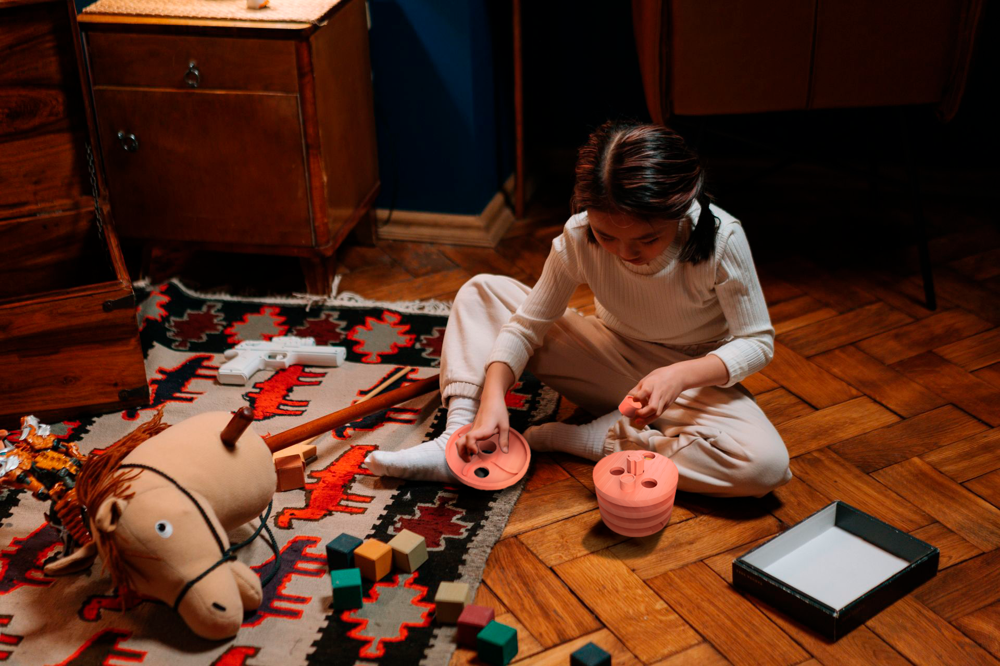
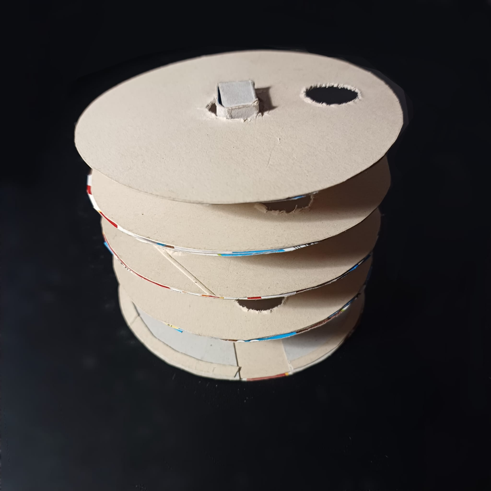
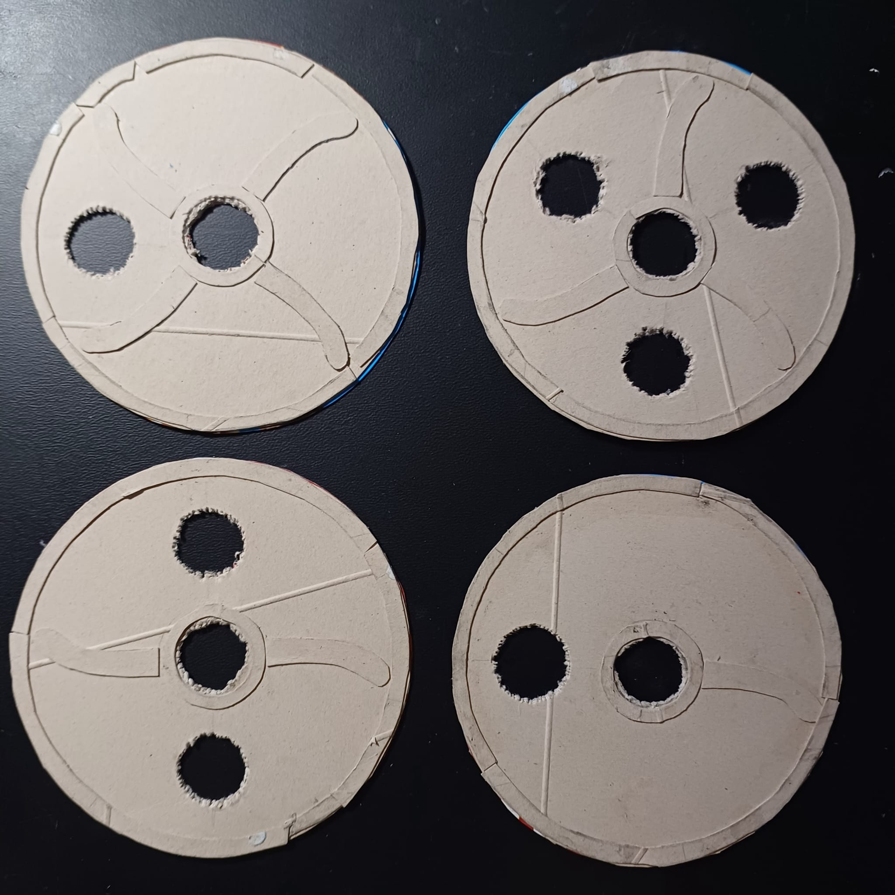
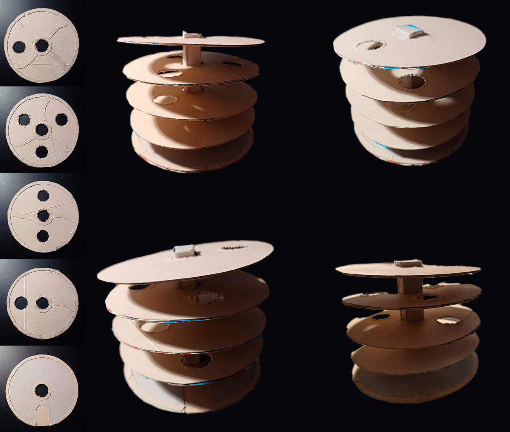
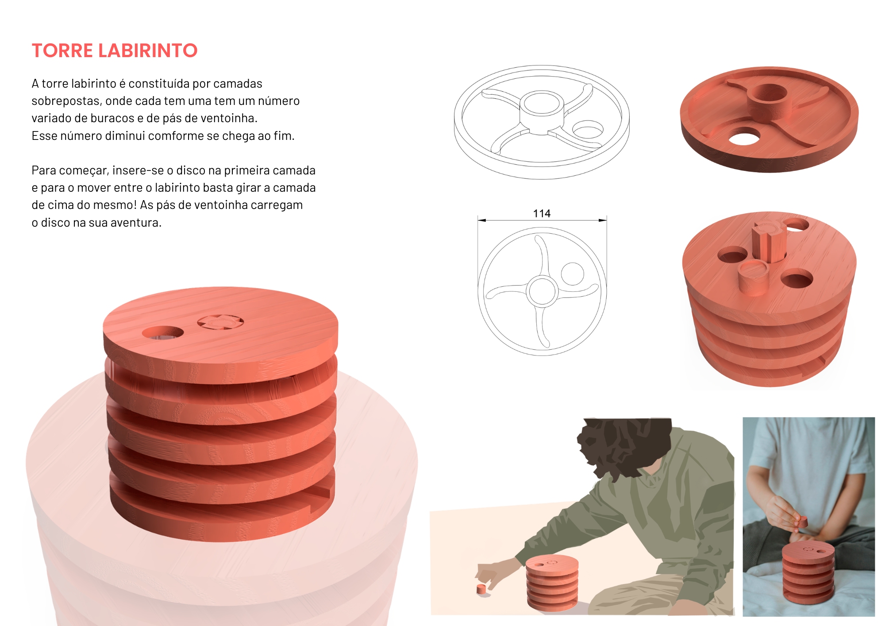
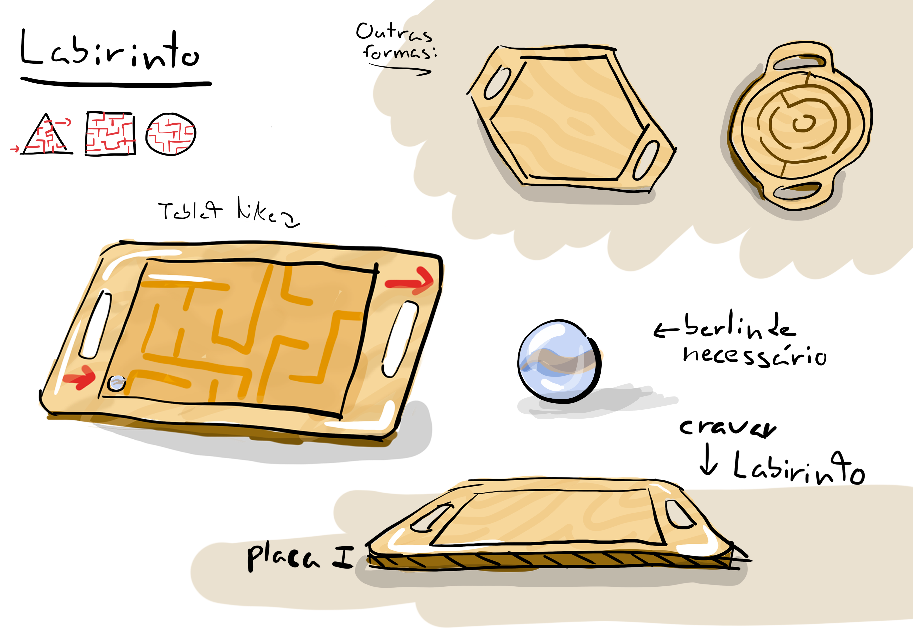
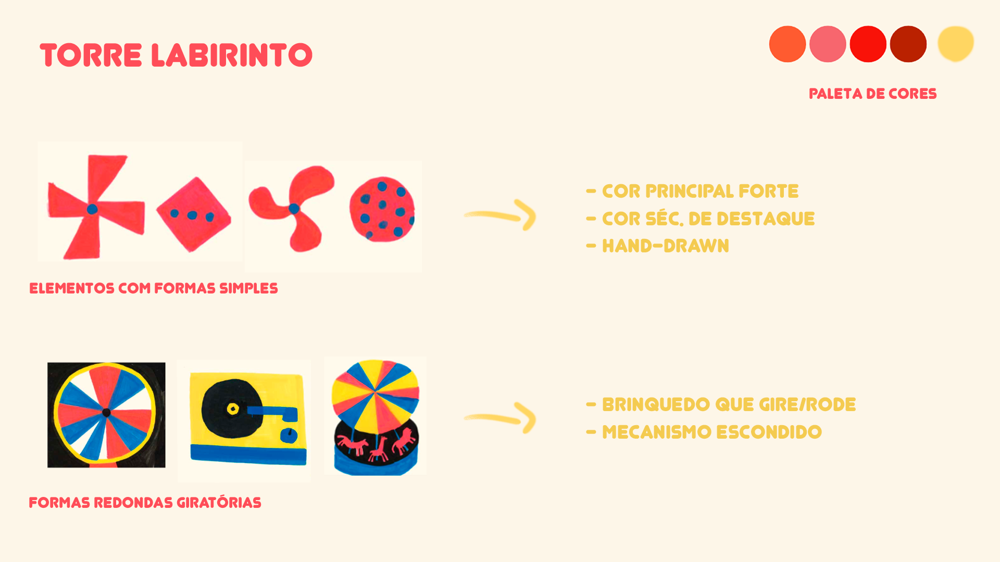
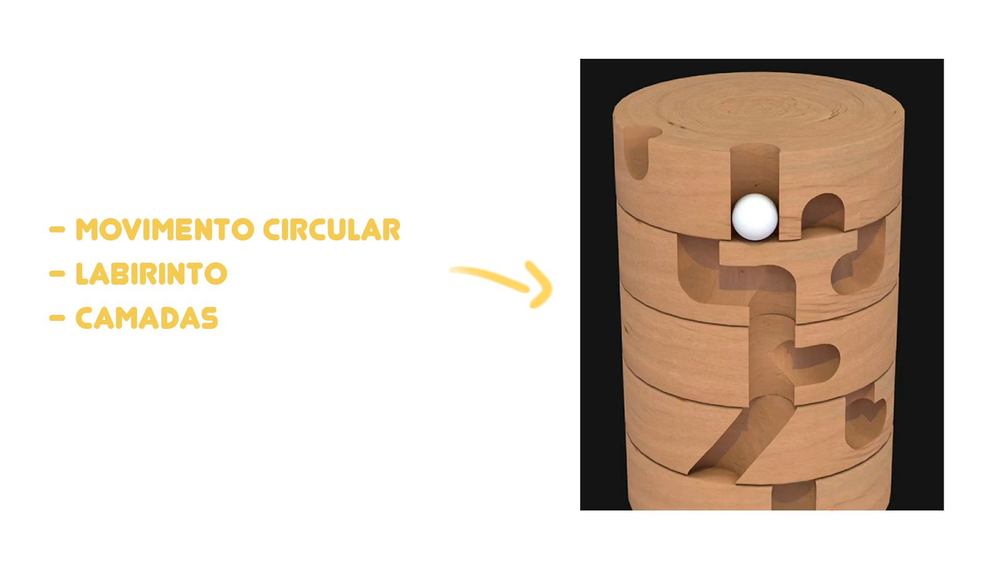
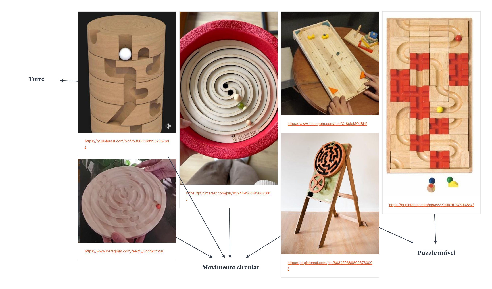
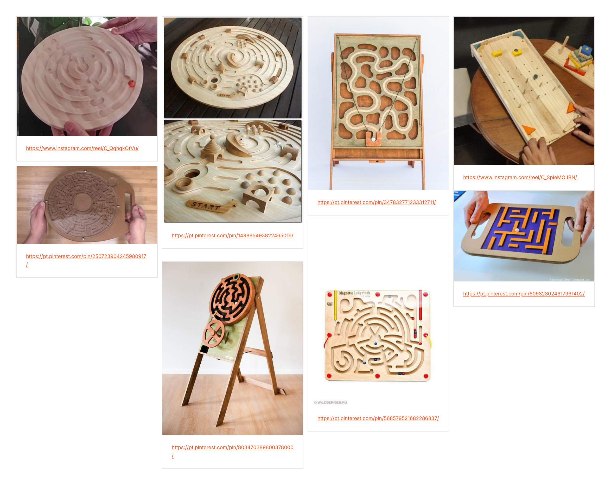

# Processo

> Organizado do **mais recente** para o **mais antigo**. Faz uma seleção que torne clara, aprazível e detalhada a evolução do produto e das ideias.

## 1. Protótipo(s)

Fotografias em estúdio com fundo branco do(s) protótipo(s) final(is).

>Render final - imitação de fotografia em estúdio

>Mochups do produto feito no Photoshop 2025

## 2. Processo de Prototipagem

Maquinação CNC, montagem, acabamentos pontuais. 

>(por tbm o arranje do fusion)

## 3. Protótipos Exploratórios

Testes CNC prévios, ensaios em escala, experiências de juntas/encaixes.

>esboços em fusion + maquete

## 4. Modelos 3D

Embed do Fusion (visualização do modelo paramétrico).

https://a360.co/4dMnO5w

## 5. Outros Modelos

Modelos físicos exploratórios, em cartão, espuma, madeira de teste.

>Maquete experimental em cartão

Esta maquete permitiu-me ver se a brincadeira era viável e apesar do uso de cartão em camadas, esta ofereceu um baixo-relevo que suportava o movimento de um disco.

## 6. Esboços e Pranchas-Resumo

Desenhos manuais, pranchas A3 de síntese, exploração de variantes.

>Prancha-resumo final

>Esboço no Fusion de uma versão antiga
>Esta versão usava muitas peças e com o auxilio do professor, foi possível reduzi-las.

>Desenho das peças para uma versão antiga do brinquedo

>Primeira prancha-resumo, de acordo com outro conceito

## 7. Pesquisa

### 7.1. Aspectos valorizados do moodboard, desconstrução da forma (o que distingue o programa formal)

### 7.2. Objetos de referência

Inventário de precedentes, brinquedos análogos, referências históricas.

>Brinquedo de maior inspiração

>Moodboard de brinquedos de inspiração para o brinquedo atual

>Moodboard de brinquedos de inspiração para uma versão mais antiga

## 9. Outros Elementos

Outros materiais relevantes para a preparação do conceito (entrevistas, observação, testes com utilizadores, notas, leituras, inspirações).

O conceito para a concessão de um labirinto derivou no meu interesse pessoal por jogos de estratégia. Por norma, são jogos que seguem um caminho linear o suficiente para o utilizador não se perder (sem saber o que fazer depois) mantendo a vertente de variabilidade.