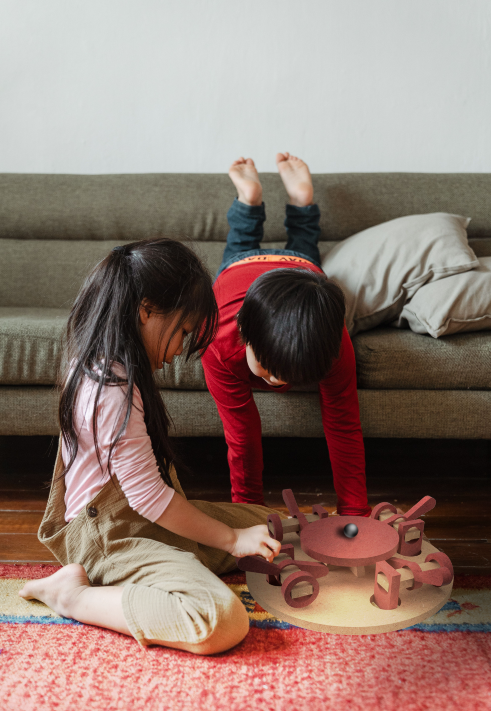
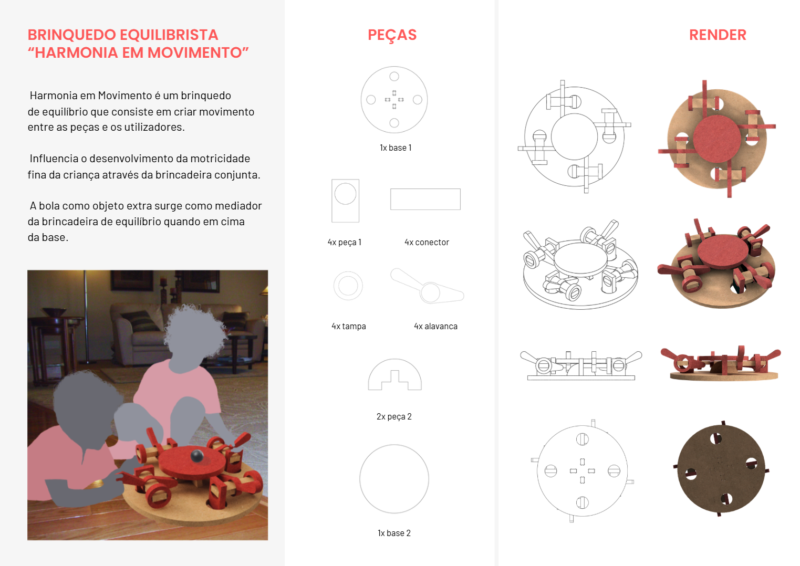
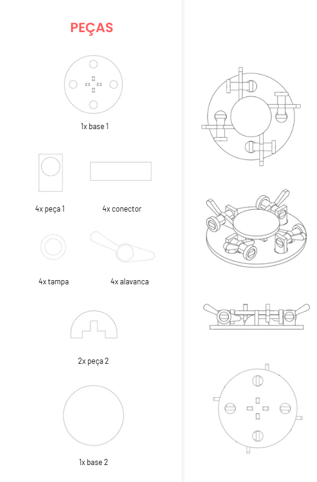
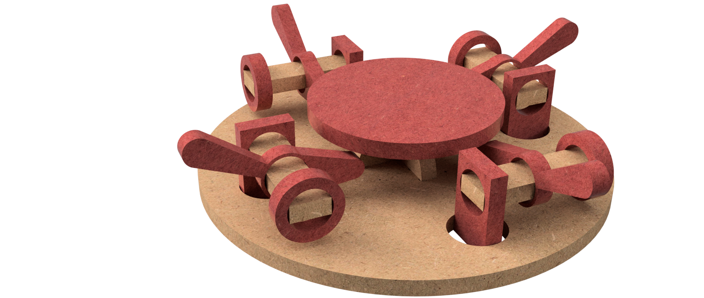
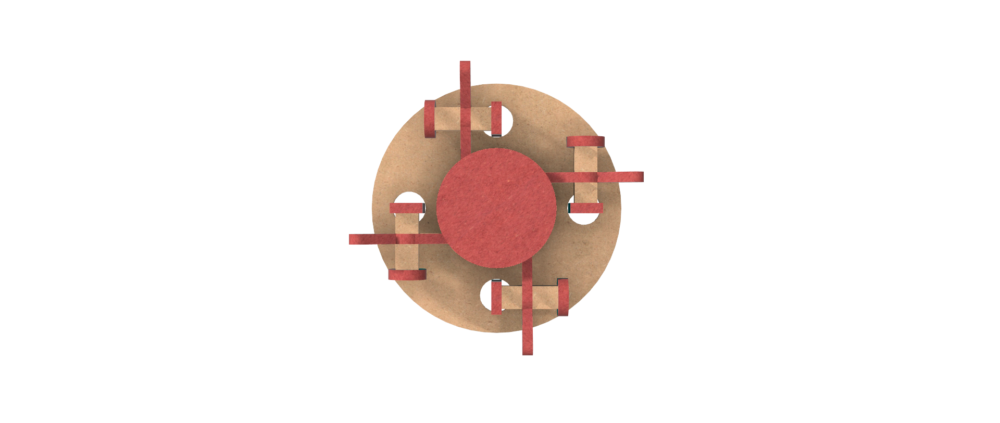
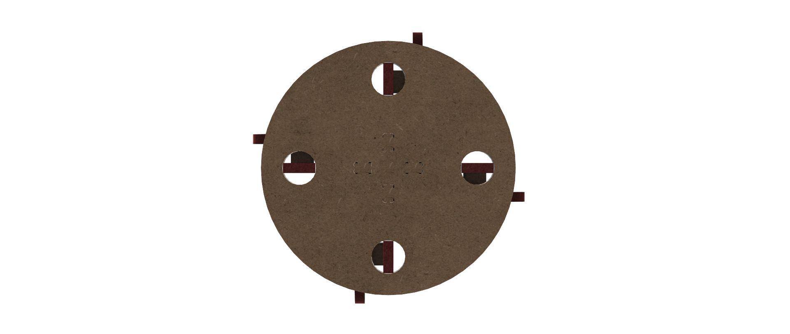
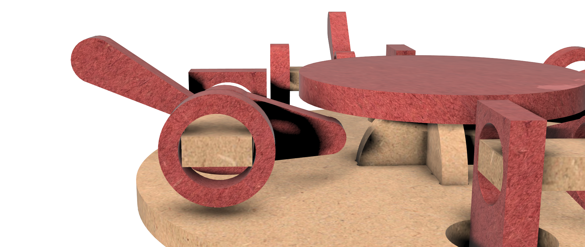

# Harmonia em Movimento

> Brinquedo de equilíbrio que cria movimento entre as peças e os utilizadores.

## Conceito

#### O que é?

"Harmonia em Movimento é um brinquedo de equilíbrio que consiste em criar movimento entre as peças e os utilizadores. Influencia o desenvolvimento da motricidade fina da criança através da brincadeira conjunta. A bola como objeto extra surge como mediador da brincadeira de equilíbrio quando em cima da base."

#### Para quem é?

  Este produto é direcionado para a crianças da faixa etária dos 7 aos 9 anos. As famílias que compram este produto direcionam-se também a tentar combater o surgimento dos ecrãs na idade infantil. Incentiva a família e amizades em partilharem um jogo de interação em comum. 

#### Porquê?

 Este objeto foi desenvolvido para ser uma brincadeira mútua que fosse divertida. Neste caso, para as idades que são introduzidas ao mundo tecnológico. Neste sentido, pensei que fosse interessante pensar no movimento e no que surge a partir da brincadeira: a criatividade, para criar naturalidade entre a intencionalidade da criança e o movimento físico.
 

## Enquadramento

Posicionamento em relação ao contexto de grupo (ver [contexto](../../contexto.md)) e à recolha de objetos a redesenhar.

## Tecnologia

Materiais (espécie de madeira), processos de fabrico (CNC, laser, impressão 3D), software paramétrico, ficheiros técnicos.

- Modelo 3D: https://a360.co/4vnxydE
- Ficheiros: ``

#### Materiais:

A escolha dos materiais foi um dos elementos comuns entre os nossos brinquedos, por uma questão de função e qualidade escolhemos Faia, Bordo e Vidoeiro como madeiras que caso houvessem disponíveis a partir de restos seriam usadas. O Valchromat vermelho faz parte da mesma lógica exceto que destaca e suscita à nossa marca gráfica. Esta cor pertence tanto ao nosso logótipo como à nossa estilização da marca em diferentes layouts. 

- Valchromat vermelho (e44e58) 12 mm. 
  Referência da Madeira: https://www.investwood.pt/valchromat/

- Faia, Bordo e Vidoeiro de 12 mm (Restos da CNC):

  Referência da Madeira (Faia): https://www.loveskirting.co.uk/beading-mouldings-c16/by-product-c230/planed-timber-c424/solid-beech-par-timber-105mm-wide-p1500

- Referência da Madeira (Vidoeiro): https://pt.aliexpress.com/item/1005007587222522.html?src=google&src=google&albch=shopping&acnt=615-992-9880&isdl=y&slnk=&plac=&mtctp=&albbt=Google_7_shopping&aff_platform=google&aff_short_key=_oFgTQeV&gclsrc=aw.ds&albagn=888888&ds_e_adid=&ds_e_matchtype=&ds_e_device=c&ds_e_network=x&ds_e_product_group_id=&ds_e_product_id=pt1005007587222522&ds_e_product_merchant_id=5452215491&ds_e_product_country=PT&ds_e_product_language=pt&ds_e_product_channel=online&ds_e_product_store_id=&ds_url_v=2&albcp=22568097293&albag=&isSmbAutoCall=false&needSmbHouyi=false&gad_source=1&gad_campaignid=22561749573&gbraid=0AAAAA_TvRHqia5k4Uw6YNcgQthwmawqh-&gclid=Cj0KCQjwi8nRBhDhARIsAHZf_pYiQQMOtCrVmquSIGjkqIw0Bb7NRYCcVJtwKxDA-5Dfsg5EY8g1VUoaAja7EALw_wcB

- Referência da Madeira (Bordo): https://www.loveskirting.co.uk/beading-mouldings-c16/by-product-c230/planed-timber-c424/solid-maple-par-timber-100mm-wide-p1646

#### Fabricação:
  
  Este brinquedo foi cortado na máquina CNC Ouplan STEEL com base na modelagem 3D realizada no software Fusion 360. Para ser cortado foi necessário um profissional operar a máquina e escolher as definições como o tamanho da fresa (6mm) e outros aspetos.
 
## Função

###### Como se brinca:
Com uma bola como objeto extra no topo da base superior, cada pessoa empurra uma alavanca. Estas alavancas controlam o equilíbrio desta base, com o intuito de não deixar a bola cair como cooperação. Quanto mais se inclina e movimenta esta base mais difícil fica o jogo, a bola vai ter mais velocidade e possibilidades de cair na direção de alguém.

###### Idade-alvo:
Direcionada à faixa etária dos 7 aos 9 anos. Porém é um jogo clássico, a faixa etária serve para criar um espaçamento entre a compreensão do jogo e até ao ponto se torna apelativo para as outras idades.

###### Montagem:
Para montar este produto é necessário ler um pequeno folheto de instruções com a informação das peças e como se monta (acompanhamento de um adulto). Primeiramente a base principal tem que ter as Peças 2 (2x) que se encaixam uma na outra e depois com uma ferramenta como um martelo assegurar que fica preso. De seguida, as Peças 1 (4x) encaixam-se nos buracos da base, que depois se vão interligar às Tampas (4x) através dos Conectores (4x). Por fim assenta-se a segunda Base 2 no topo das peças cruzadas no centro da base.

###### Conformidade com a Diretiva 2009/48/CE:

O brinquedo cumpre algumas das seguintes regras:
 
É concebido e fabricado de modo a não apresentar qualquer risco mínimo inerente à sua utilização normal;
Não tem a presença de substâncias cancerígenas, mutagénicas ou tóxicas;
Obedece a regras de segurança específicas como a disponibilização de informações claras e acessíveis aos consumidores sobre os riscos residuais e as instruções de uso;
Tenta garantir um nível elevado de segurança sem colocar risco a saúde ou segurança das crianças, evitando vértices, partes afiadas ou números extremos de dimensões da partes do objeto, para evitar ser ingerido ou pesado.

## Apresentação

## Processo

[Ver processo completo →](processo.md)
