# Processo

## 1. Protótipo(s)

Estas são as fotografias do protótipo final cortado na CNC. Usei uma placa reutilizada do FabLab.

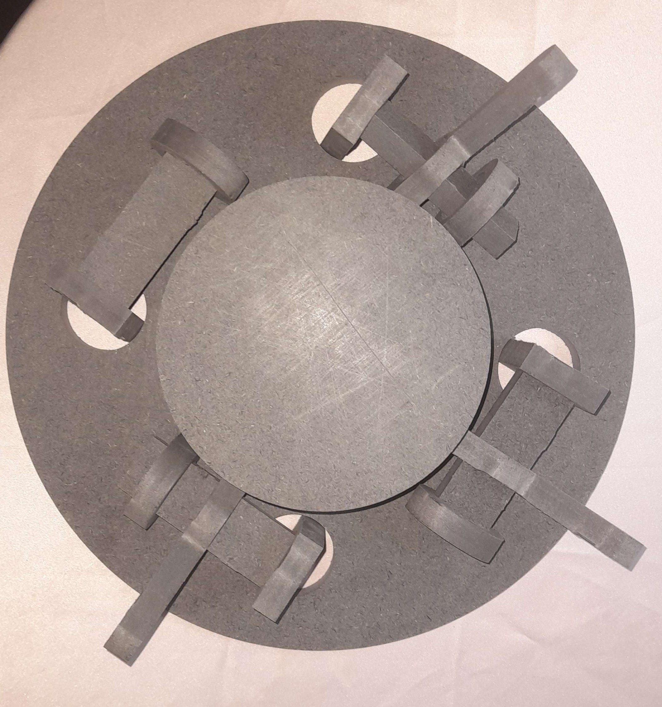

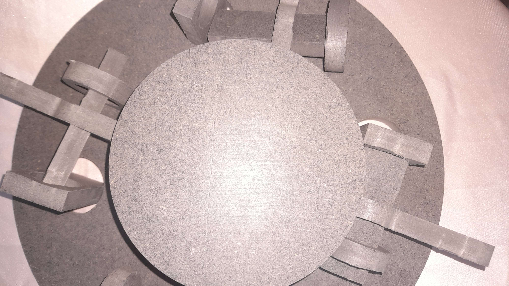

## 2. Processo de Prototipagem
   
 Para projetar esta maquete para a Maquinação da CNC foi necessário criar um setup na Manufaturação do Fusion. Porém no planeamento para a CNC não fiz arrange e em vez disso usei o align, que ficou imperfeito e com desalinhamentos com a placa do ficheiro. Teve de ser redefinido e depois para cortar este ficheiro, definir as definições da fresa e outras questões para a CNC tive a assistência do professor. Usei uma placa reutilizada de 12 mm.

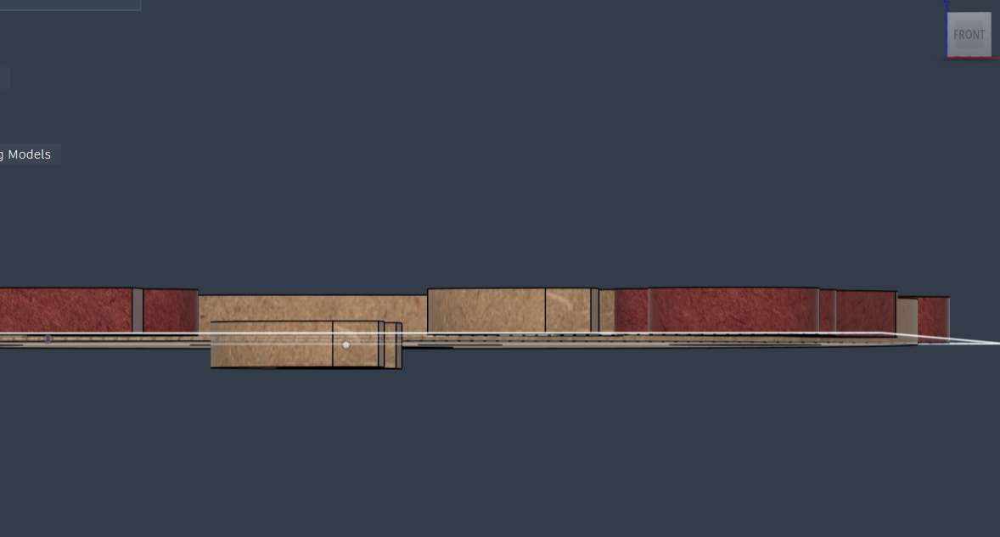

 Antes da montagem, tive que retirar as peças da placa e apesar de ter sucesso, reparei na fragilidade das peças. Tentei evitar erros ou que o objeto se pudesse partir quando fosse cortado pela CNC. Aprendi que mesmo que use no mínimo 5 mm, as peças têm tendência a serem muito sensíveis por causa do material, a forma que é cortado ou até como se separa as peças. Aprendi que é preciso verificar sempre os ficheiros e ter experiência com manufaturação quando se trata de transmitir o objeto exatamente como é pensado.
 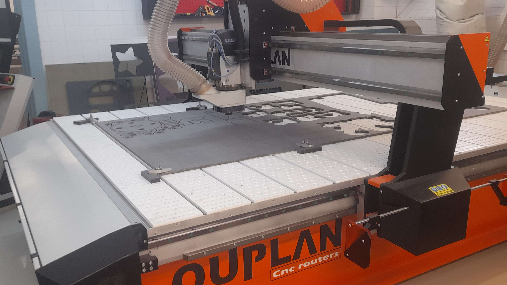

É possível notar na imagem final do protótipo que também falta uma peça e é importar mencionar que se partiu ao meio por ser um círculo acompanhado pelos motivos que referi anteriormente (margem mínima causa fragilidade). 

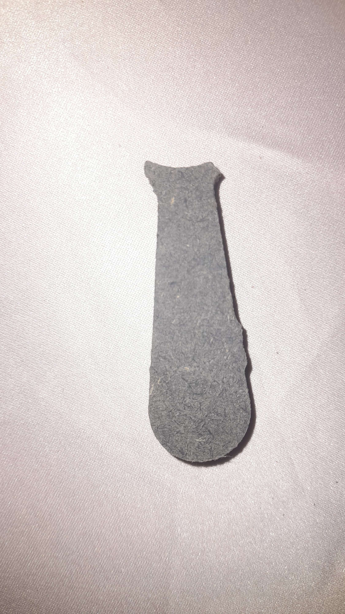

Alguns outros aspetos que não correram tão bem foram os elementos com os encaixes estão desproporcionais e soltos enquanto a base superior ficou estável. É possível ver nestes vídeos de demonstração:

Acredito que muitos aspetos da CNC correram mal porque nada encaixava e estava tudo muito solto ou muito apertado devido a eu ter adicionado folgas aos círculos. É importante relevar que com este protótipo descobri uma questão importante: as trancas em círculo são disruptivas da forma que coexistem com o modelo porque se mexem mais de 180 graus sem propósito.

PEÇAS INDIVIDUAIS:

PEÇA 1 4X

CONECTOR 4X

BASE 2 1X
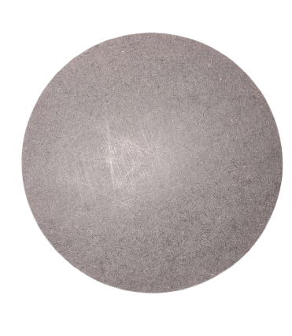
ALAVANCA 4X

Peças para equilíbrio 2x encaixadas na base.

Base de baixo.

## 3. Protótipos Exploratórios

Previamente já tinha realizado experiências exploratórias que testavam questões de estabilidade das bases, proporções entre as peças, encaixes e a dificuldade do jogo. Criei um modelo 3D com todos os aspetos que queria explorar e cortar na CNC. 

Porém, este modelo tinha aspetos como folgas erradas, margens abaixo do mínimo, os parâmetros foram mal definidos e quando tentei ajustar as formas elas ficavam permanentemente com erros. Acredito também que se não tivesse feito esta maquete e não ter recebido feedback sobre a mesma iria ter erros graves no resultado final da prototipagem.

Esta protótipo exploratório é composto pelos passos similares da maquete final, o que muda são os parâmetros e a dependência entre os corpos do objeto. Por este motivo, decidi que seria mais relevante não excluir este projeto mas  mostrar só o processo completo na fase final.

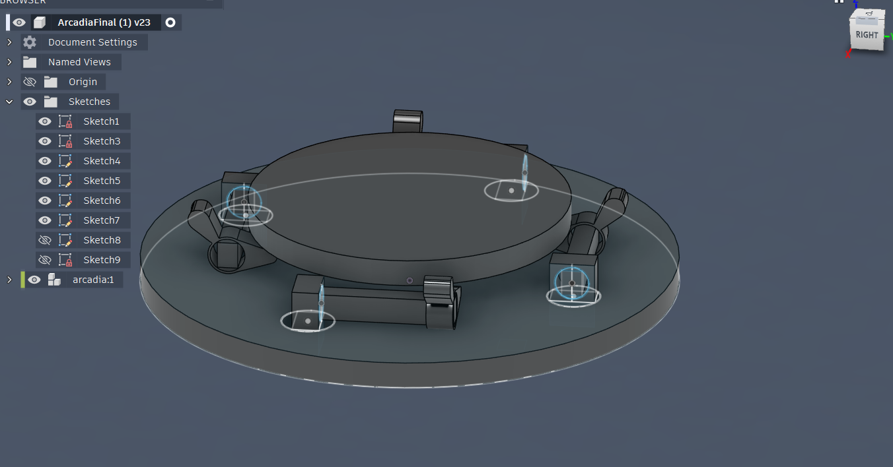

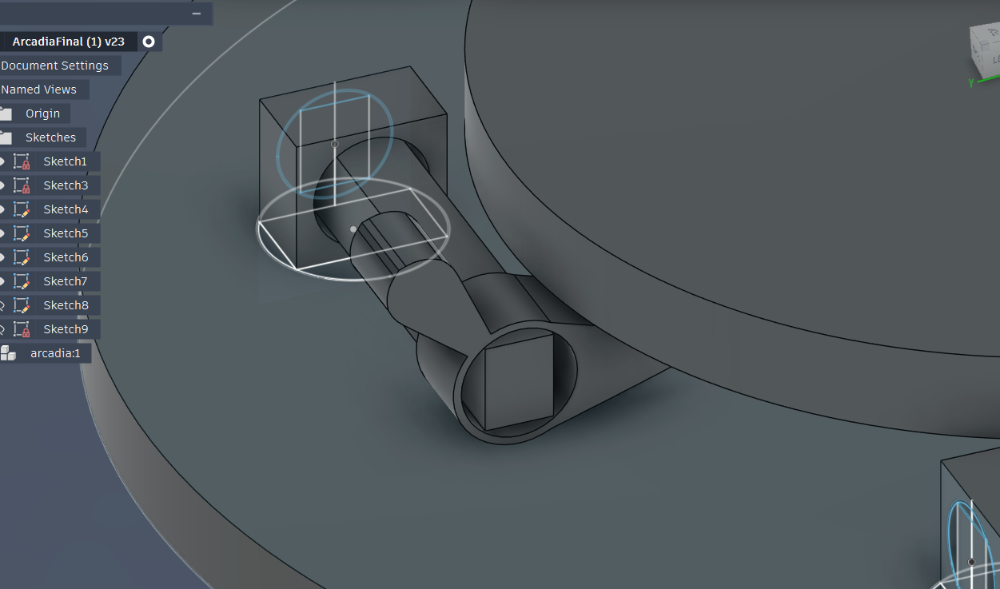

Como é possível ver, as peças não se completam com a base, as folgas estão erradas, não existe a noção do espaço, tamanho, nem da dependência das peças através de trancas, suportes e encostes.

Algumas imagens do modelo pronto para a CNC com os problemas mencionados.

Embed do Fusion (visualização do modelo paramétrico).
https://a360.co/4es6Ucz

## 4. Modelos 3D

##### MODELO 3D: SEGUNDA EXPERIÊNCIA 

A minha segunda experiência foi o meu protótipo final.

Para o criar comecei pelos parâmetros:

(Todas as medidas são editadas com a matemática do Fusion, por este motivo vou evitar mencionar-las). Depois de já ter criado um círculo para a base, criei um esboço de um círculo na mesma base. usei a extrusão e usei o circular pattern. Neste mesmo esboço desenhei um retângulo tangente ao círculo que depois extrudi com a espessura da base (1,2 cm) para baixo.

Desenhei também no plano frontal em cima da base metade de uma curva com 3,50 cm de altura e 4 cm de largura que dupliquei para o lado com o Mirror. Depois desenhei um corte inferior de 1,75 cm de altura e 1,20 cm de largura com as medidas divididas pela linha central.
e outro de uma curva que depois usei o mirror. Mais tarde usei a extrusão e desenhei outro igual que extrudi e criei um corte igual por cima que depois com o combine ficaram os dois encaixados.

Com aqueles retângulos extrudidos da base, extrudi para cima novamente com 4,80 cm ( a partir de um comprimento, 3 cm, menos a espessura)

Depois esboçei centrado em cada um destes paralelepípedos um círculo com 2,98 cm (tem uma folga de 0,2 mm) e adicionei outro retângulo dentro deste círculo com a espessura de largura e 2,70 de largura com os vértices tangentes ao círculo (pode ter folga).

Extrudi em corte com a espessura em todos estes paralelepípedos. 

Usei o retângulo anteriormente desenhado e extrudi com o seu comprimento: 9 cm. De seguida usei o circular pattern quatro vezes para adicionar aos outros elementos.

Depois desenhei na ponta do paralelepípedo o círculo para a tranca que não permite as outras peças se mexerem. Extrudi para dentro com a espessura e voltei a usar circular pattern.

Depois criei um plano de construção e desenhei no meio do paralelepípedo no plano lateral a minha alavanca. começo por fazer o círculo interior com a respetiva folga e o exterior com 3,01 e 3,50. De seguida desenhei uma linha do ponto central do círculo com 4 cm até à tangente do círculo da direita que tem 1,50 e situa-se abaixo da base superior. Do mesmo ponto central meço verticalmente 3 cm e 5,50 cm de largura até ao centro do nosso próximo círculo à esquerda. Este círculo tem 2,00 cm. Crio uma linha de apoio desde o ponto central do círculo de 3cm até ao centro do de 2,00 cm. faço uma linha tangente aos dois círculos que tem uma margem de 0,50 até à linha da simetria. Por fim, duplico com o Mirror esta linha e extrudo esta forma toda com a espessura toda a parte interior do círculo onde está o paralelepípedo. Volto a usar circular pattern para repetir quatro vezes.

Para criar a base superior faço um esboço dum círculo a partir de um plano de costrução com a altura das formas cruzadas que estão debaixo.

Para prender as primeiras formas cruzadas criadas depois da base extrudo com a espessura até à base e uso o combine e keep tools para fazer um buraco. Para ficar justo, adicionei dogbones.

Caso fosse refazer este modelo para não estar tão solto, iria só mudar os parâmetros das folgas desta forma para ficar mais justo e adicionalmente, prender as trancas dos círculos à base.

Embed do Fusion (visualização do modelo paramétrico).
https://a360.co/4vnxydE

##### MODELO 3D: PRIMEIRA EXPERIÊNCIA 

A minha primeira experiência 3D derivou dos meus esboços, no qual pensava nas formas como objetos simplificados, ou seja, elementos como alavancas e bases de apoio eram paralelepípedos e bases com formas verticais geométricas a dar suporte. 

Tentei simplificar as formas ao máximo só para ter um modelo 3D inicial, para perceber a construção ideal para o meu protótipo final na construção 3D. Pensei em criar um bom equilíbrio entre o tamanho das peças. Acabei por perceber que esta construção mesmo simplificada, não era a melhor, porque todas as peças exigiam extra bases para as segurarem.

Para iniciar a construção deste modelo, criei o meu ficheiro híbrido no Fusion adicionei os parâmetros.

Desenhei um círculo para a base com o primeiro parâmetro de 200 mm.

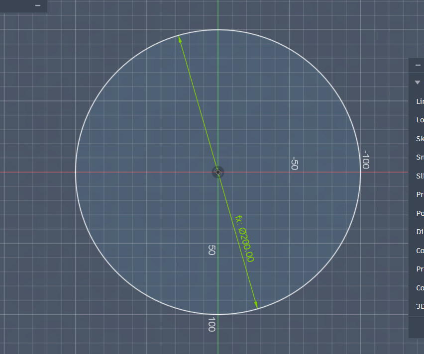

Depois usei a extrusão na base com a minha espessura geral: 19 mm. Na mesma base, desenhei outro círculo de 80 mm.

Neste mesmo círculo criei dois retângulos que depois deixei tangentes ao círculo de forma simétrica com a medida da espessura (19 mm). Depois deste passo usei a extrusão num dos retângulos.

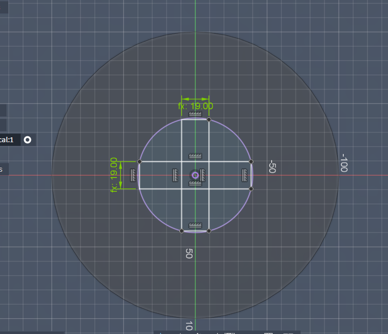

Criei um corte inferior com 25,95 cm que depois extrudi como corte.

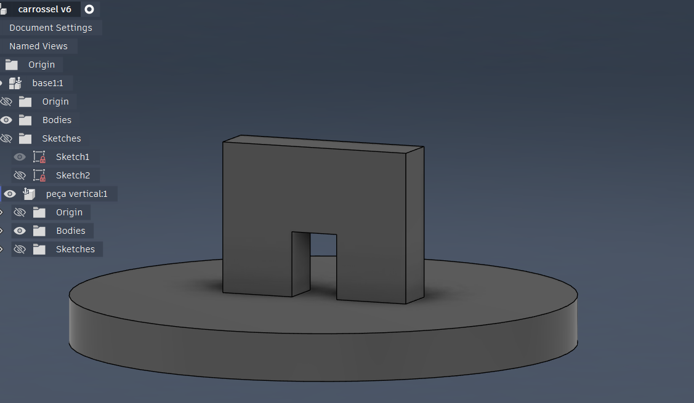

Usei a extrusão no outro retângulo também e desta vez criei um corte na área superior com a mesma medida e usei a extrusão para cortar a peça novamente. Depois destes passos usei o combine nas duas peças.

Criei outro círculo com 100 mm e usei o para criar um buraco na base à volta das peças. De forma similar criei outro círculo igual mas desta vez por cima das peças, que depois acrescentei a espessura com a extrusão.

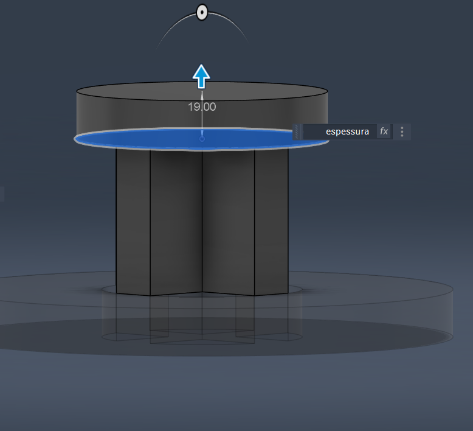

Criei outro esboço na base debaixo com uma peça que extrudi com a espessura para depois criar as outras peças com o circular pattern que circulam esta base.

De seguida criei um círculo nesta base de construção na imagem interior. Fiz um círculo que quase não tocasse nas peças e extrudi para cima com a espessura. De seguida criei outro esboço tangente a esta base e extrudi com a mesma grossura desta base para baixo. Por fim adicionei o combine para esta alavanca ficar junta a esta base circular.

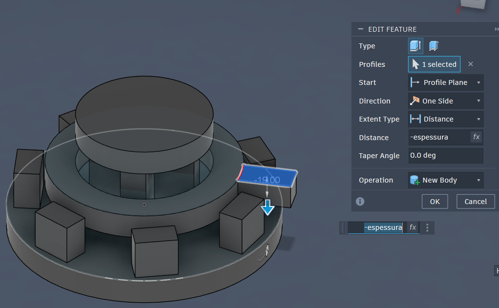

Embed do Fusion (visualização do modelo paramétrico).
https://a360.co/44lM2Pr

## 5. Outros Modelos

##### MODELO EM CARTOLINA E CARTÃO

Esta maquete foi criada tanto para poder experimentar fisicamente as proporções como para testar a sua funcionalidade. Tentei ser fiel ao máximo e ajustar as medidas como achava que deveriam ser detalhadas. Apesar da maquete ter corrido bem, o material causa problemas com as medidas sendo que a cartolina e o cartão são moderadamente mais ágeis do que a madeira.

Algumas fotos do esboço inicial para poder maquetizar as medidas.

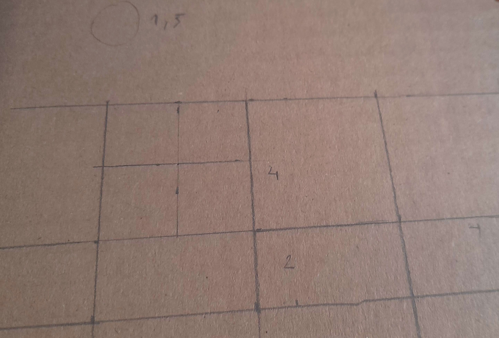

Para poder ficar fiel ao projeto em todas as peças tive que colar 3 pedaços de cartão para ficar com a mesma espessura.

##### MODELO EM CARTÃO

Esta maquete foi a primeira que fiz depois de ter desenvolvido esta ideia. Inicialmente não conseguia avançar com por já ter desenvolvido tantas ideias antes e por este motivo tentei fazer uma maquete extremamente simples com cartão e fita-cola. Tentei iniciar o projeto e avançar com o meu conceito e aprendi que foi extremamente essencial fazê-la para começar a perceber os mecanismos do objeto e a sua função como brinquedo.

## 6. Esboços e Pranchas-Resumo

##### PRANCHA-RESUMO FINAL

Esta prancha-resumo surgiu a partir dos renders que tinha feito. Achei que quanto mais simples e similar a um manual de instruções fosse, melhor era. Sendo que este é um brinquedo que necessita de espaço e compreensão de como se usa de forma intuitiva. Adicionalmente criei a ilustração das crianças a brincarem com o brinquedo com a esfera para ilustrar a interação humana num ambiente e uma distância amigável entre as pessoas quando o jogam. 

##### ESBOÇOS DETALHADOS DA HARMONIA EM MOVIMENTO

O conceito deste jogo começou a florescer depois de realizar esboços sobre a ideia e possíveis mecanismos.

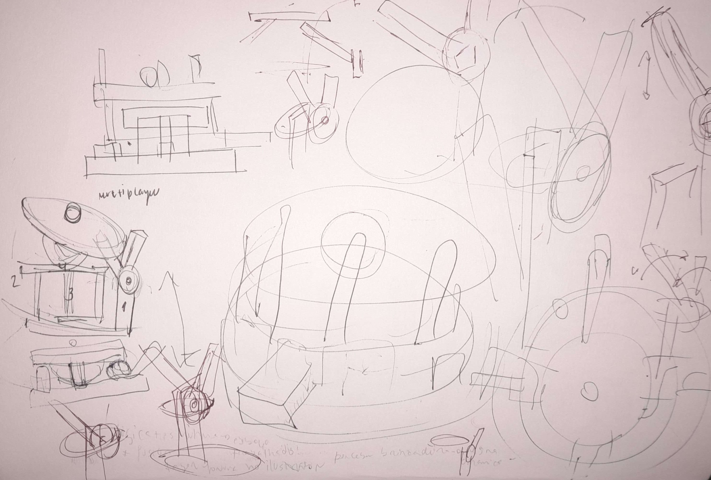

Nestes Esboços Rápidos estava a tentar compreender a funcionalidade e o mecanismo das alavancas, uma coisa que não me é familiar em modelos de madeira. 
Com o feedback e as demonstrações do professor tentei esboçar as possibilidades do objeto a nível conceptual como a nível mecânico. Por exemplo, em vez das alavancas estarem presas à base ficam presas a um paralelepípedo vertical que depois tem suporte na base. Outra sugestão foi em vez de ser um carrossel impulsionar a brincadeira com ideia que tinha que não conseguia desenvolver, tornar a brincadeira das arcades num brinquedo de madeira com equilíbrio, em vez de um movimento circular que sobe para cima e para baixo que é só causado por uma pessoa.

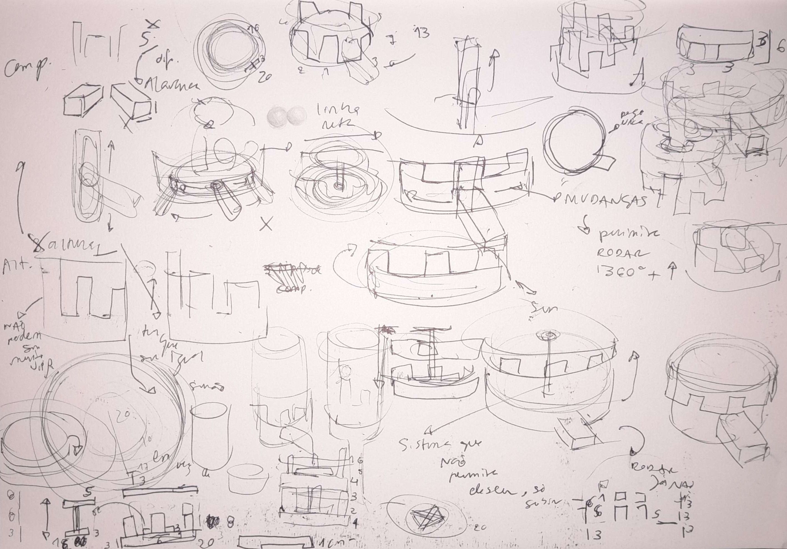

Estes esboços em Detalhe foram os primeiros da ideia da Harmonia em Movimento enquanto ainda não tinha a certeza de que conceito iria aprofundar. Estes esboços estão associados ao primeiro modelo 3D que fiz e na área superior do esboço é possível ver eu a explorar as possibilidades de como poderia ser o objeto. 

Pensei em como as trancas iriam possibilitar o movimento da alavanca preso à base circular se rodasse 360º graus e o objeto não se desmontasse, possivelmente com um suporte que o limitaria, para não virar uma espécie de "oreo" que se desfazem as peças umas das outras. Nestes esboços averiguei também em como as peças iriam subir em forma de escada se estivessem dentro ou debaixo da base superior, sem que a base do objeto mexesse. Tinha em mente a altura e diversidade das trancas, um suporte vertical no meio da peça que prendia as duas mas que não permitia que se abrisse e um sistema mecânico como os carrosséis dentro do próprio objeto.

##### IDEIA: FICA EM PÉ

Esta esboço tinha haver com uma brincadeira que cria desenvolver que tinha em conta o jogo dos ferros do cavalo de acertar num paralelepípedo, porém o jogo ficava ao contrário. O intuito do jogo era atirar esta espécie de tubo para dentro das cavidades das formas que abanam numa superfície plana como o chão sem que elas caíssem, quase como no bowling. Estas peças teriam este formato para conseguir criar um bom equilíbrio mas se a forma acertasse com força de frente as formas iriam cair e a pessoa perdia o jogo. 
Pensei nas dificuldades como tentar acertar em buracos mais pequenos ou menos redondos e a possibilidade de haver várias formas iguais com as mesmas cavidades para ser mais difícil de duplicar pontos. Gostaria de ter desenvolvido esta ideia em detalhe porque acho que iria ser divertida de brincar em qualquer faixa etária.

##### IDEIA 1: CARROSSEL 

Esta foi a ideia do carrossel de madeira que acabei por desenvolver. Inicialmente baseava-se num jogo de controle do movimento, no qual o carrossel é apenas um carrossel. O desafio estaria em tornar-se num brinquedo puramente de madeira e ser funcional sem eletricidade ou materiais extra. 

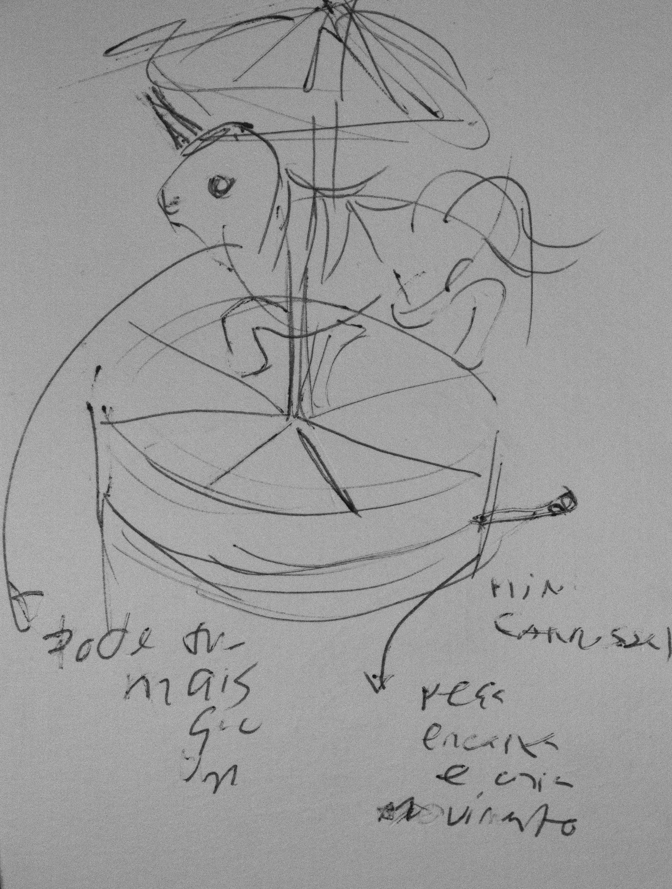

##### IDEIA 2 e 3

Esta ideia era de carácter decorativo por isso não tinha potencialidade. Com uma forma fina no meio as peças poderia se ir montando uma forma em concreto de frente ou de lado, similar a um ábaco. Não tinha propriamente uma brincadeira mas um carácter de construção visual. Cheguei a desenvolver esboços digitais que eram mais representativos desta ideia mas acabei por perdê-los. Contudo, foi essencial a fase de desenvolvimento desta e das outras ideias.

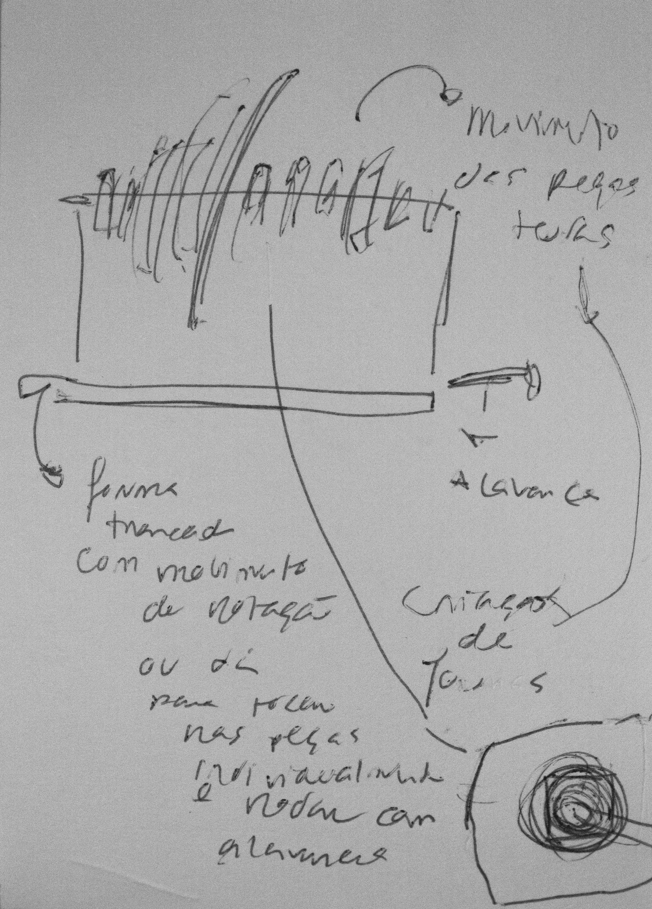

Tal como o esboço anterior, foca-se no mesmo conceito mas de forma vertical, porém ter a vertente de projeção de sombras a partir da montagem das formas.

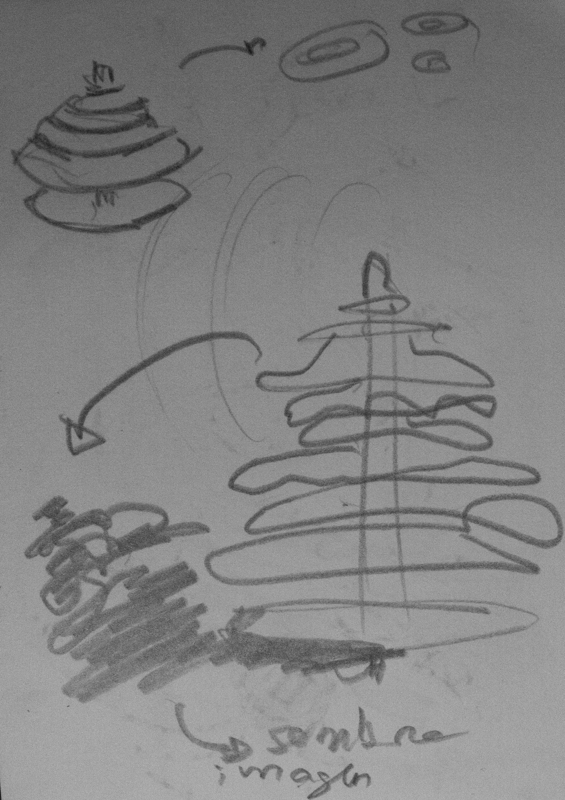

##### OUTRAS IDEIAS

Pensei nesta ideia como uma hipótese mas sem muita consideração. Seria como os jogos de mover os círculos dentro de uma substância líquida até acertar no objetivo ( como um tubo ou um paralelepípedo. Novamente, a ideia era transformar este propósito numa construção puramente de madeira. Pensei em peças pequenas que se moviam numa base, porém havia limites como a transparência por não haver vidro e não conseguir traduzir esta brincadeira com a substância líquida para algo que seja divertido com sólidos. Acredito que esta brincadeira teria mais potencial se fosse criada numa máquina 3D ou em resina pelas suas propriedades. 

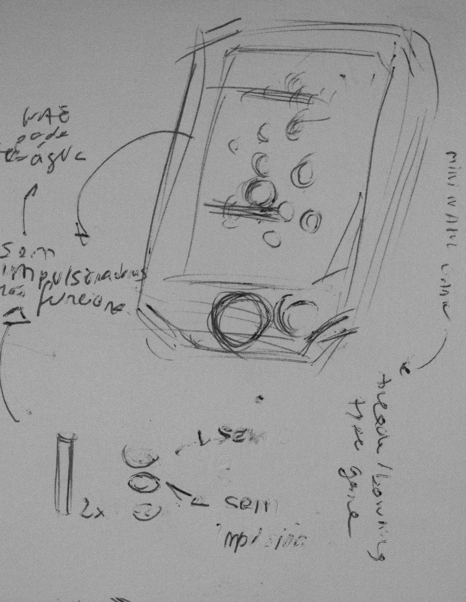

Esta ideia foca-se no controlo dos membros do brinquedo, ou seja, a ideia ser um brinquedo móvel com articulações que desse para desmontar e criar novas ideias de animais, objetos, etc.

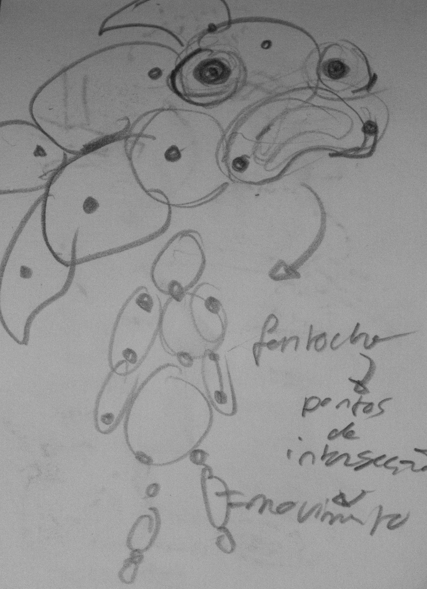

Tal como os outros esboços, este foca-se novamente na criação de uma imagem em concreto através das formas mas desta vez pela sobreposição delas. Por exemplo, criar uma borboleta de madeira com várias camadas nas asas.

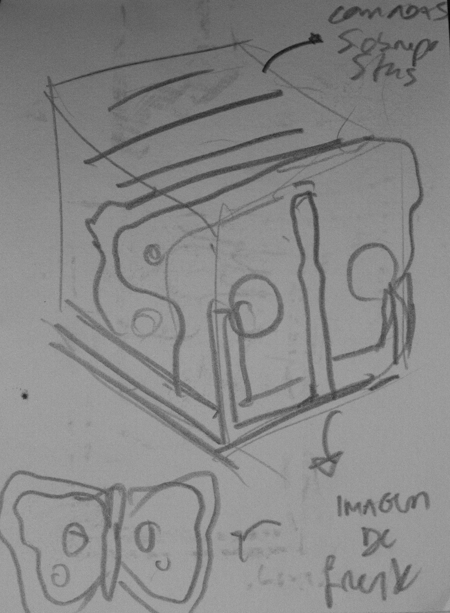

Esta ideia associa-se ao tetris mas se fosse só em madeira, no qual a variedade das madeiras iria ter um propósito no jogo: a combinação.

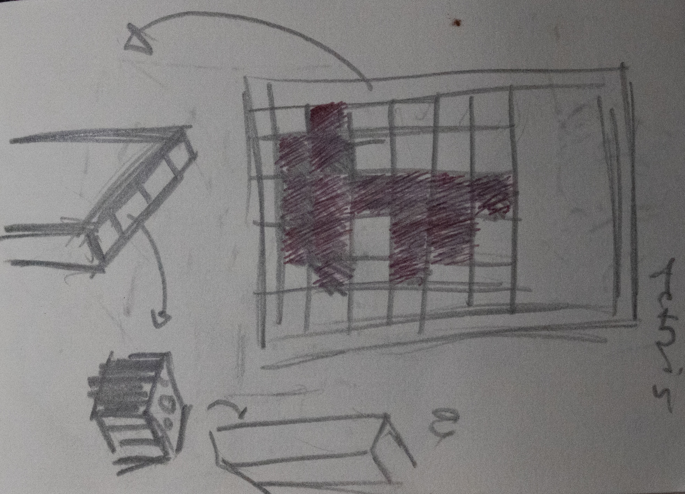

Este esboço foi baseado em jogos como o micado e outros de equilíbrio mas neste caso em forma de esfera. As peças de madeira juntam-se e criam uma esfera que se desfaz por camadas.

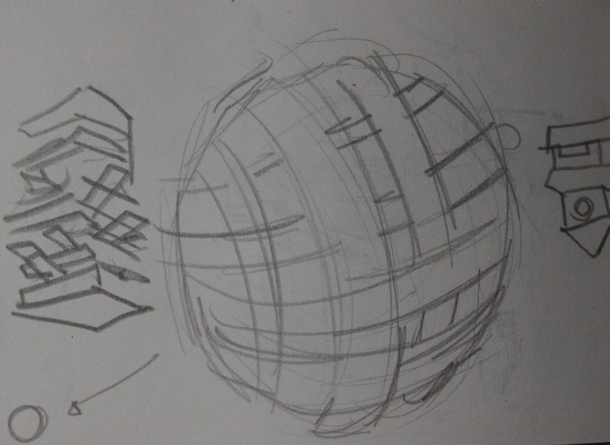

##### PRANCHA-RESUMO INICIAL

A minha prancha resumo inicial focava-se num jogo de encaixes infinitos que formavam qualquer tipo de formas e combinações. Esta ideia era interessante mas não tinha um jogo em si e era muito difícil de desenvolver pelas complicações de produção.

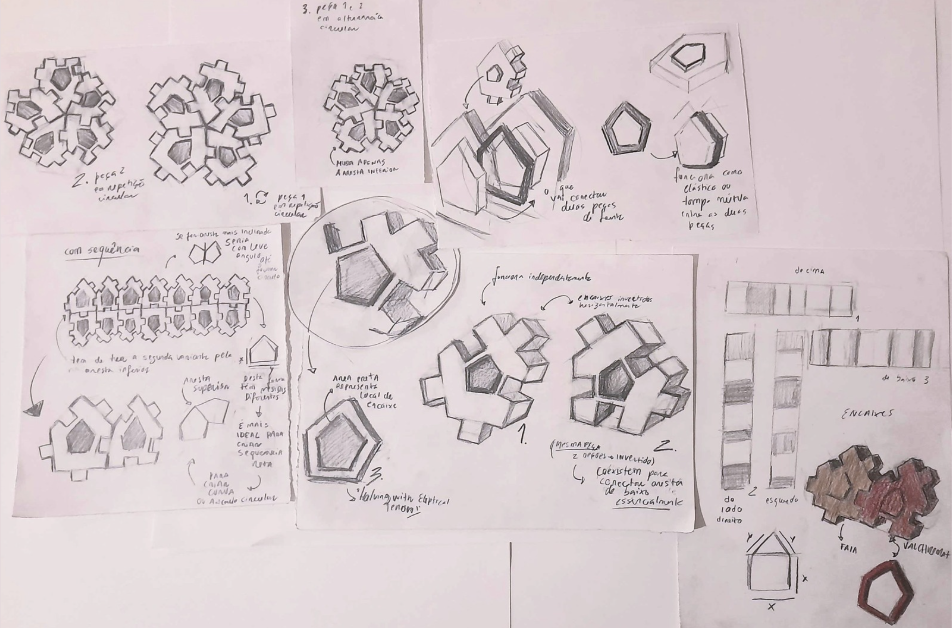

## 7. Pesquisa

### 7.1. Aspectos valorizados do moodboard, desconstrução da forma (o que distingue o programa formal)

Os aspetos que valorizei do moodboard têm haver com a fluidez das formas e a linguagem gráfica: o meu objeto tem essencialmente curvas e paralelepípedos que se encaixam sem muita complicação. 

Acredito que o moodboard contribuiu sobretudo para as diferenças e aspetos comuns entre os projetos do grupo. O valchromat é também representativo das cores e formas do nosso moodboard. Tentei também me apropriar da simetria e conceitos de alguns destes símbolos como o carrossel, a roda da foturna, o cata-ventos, a estrada e o prato de comida.

A tagline "movimenta a imaginação" suscita a esta composição visual em todos os projetos, sendo que nos focamos na interação física perante a criatividade da criança que é valorizada pela nossa marca perante a tecnologia avassaladora que as consome tão cedo.

Apesar do nosso moodboard antigo estar afastado dos nossos conceitos atuais, a sua simplificação contribuiu para uma exploração mais aberta dos conceitos. Por outro lado, as formas retas e constrangidas que tinhamos anteriormente como base para cada projeto individual criavam restrições criativas e problemas direcionados ao público-alvo. Tendo em conta que as formas são muito perfeitas e retas, não se adaptava à linguagem gráfica e visual que criamos criar como marca. 

### 7.2. Objetos de referência e outros elementos

Algumas ideias quando pensei no conceito de jogo divertido que me começaram a surgir à mente quando fiz esboços foram os jogos de Arcade, Tetris e num aspeto matemático o Ábaco de matemática e neste caso também o ábaco infantil simples colorido.

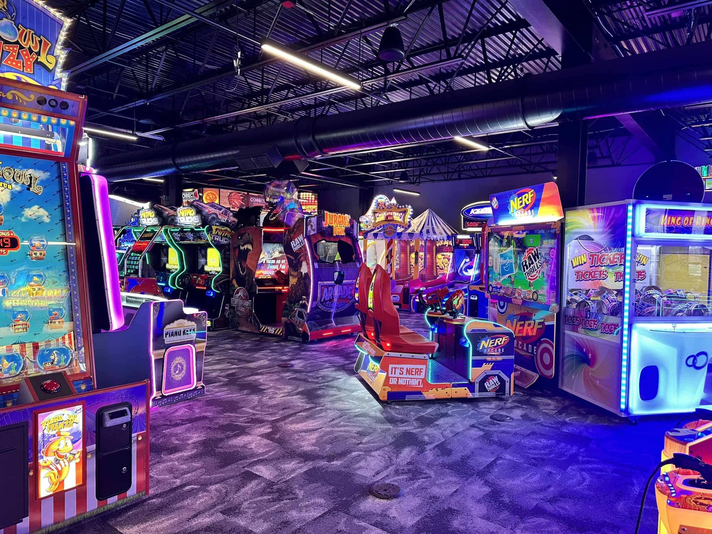

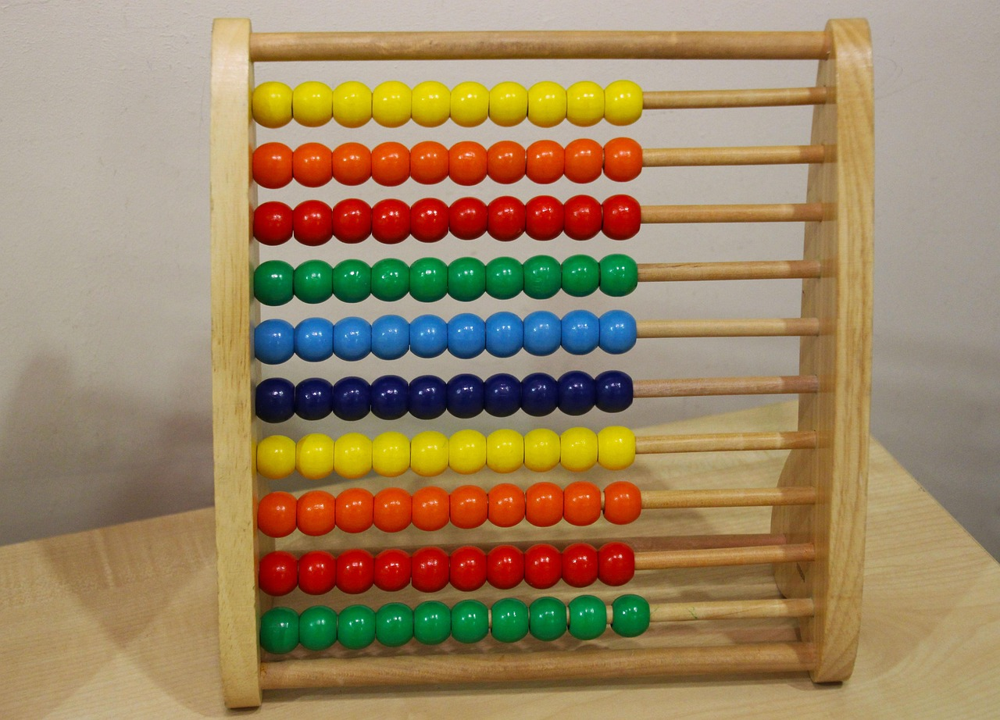

(Referências das imagens:
_Block Blast Online_. (2026). Block Blast Online. https://blockblastonline.io/puzzle-blocks-classic
_Vamosa Rema_. (n.d.). Vamosarema. https://vamosarema.com/
_Pixabay_. (2016). Pixabay.com. https://pixabay.com/pt/images/search/%C3%A1baco/
_2 Brinquedos para Bebê Educativo Infantil de Montar e Desmontar_. (2019). Madeiramadeira.com.br. https://www.madeiramadeira.com.br/2-brinquedos-para-bebe-educativo-infantil-de-montar-e-desmontar-762621197.html)

‌

Algumas das referências que me afetaram propriamente para o desenvolvimento do projeto foi o V-smile da marca Vtech. Criei este moodboard previamente para perceber o tipo de produtos da marca para além do V-smile. O motivo de ser uma referência é pela forma que a linguagem dos produtos é criada. Existe uma delicadeza nas formas e no direcionamento ao público-alvo através da cor e até dos cantos dos objetos. Apesar de ser relacionado à tecnologia acredito que foi uma ótima referência num sentido de simplicidade e direção.

Link para o site do Vtech: https://www.vtech.com/

Outra referência importante foi o moodboard que fizemos e as ideias discutidas com o meu grupo numa fase muito inicial. Estes brinquedos não eram propriamente uma inspiração direta mas ajudaram a desbloquear a mente para irmos procurar mais referências e temas em comum dentro do nosso moodboard. 

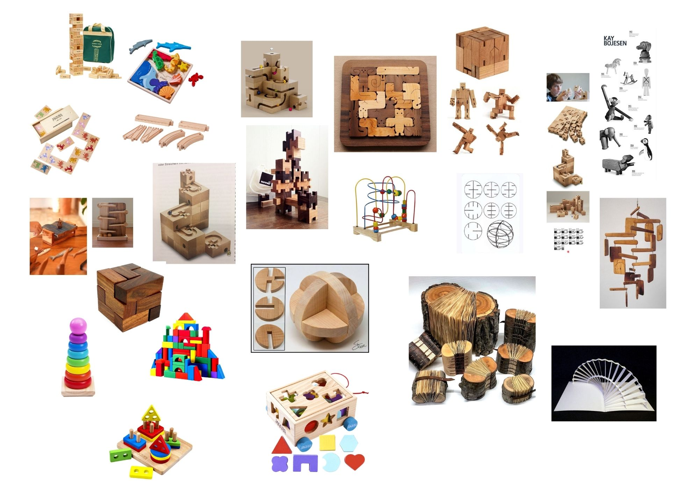

Este moodboard que fizemos em grupo para a parte gráfica da marca foi também essencial para compreender a conexão entre os conceitos aplicados nos objetos só pertencendo a uma marca. Neste caso, também o fizemos para compreender o nosso público-alvo e o que seria menos racional e mais criativo de abordar alinhado com o nosso logótipo e os nossos conceitos.

Acredito que o complemento entre as duas disciplinas ajustou-se perfeitamente. No sentido em que mesmo numa fase de desenvolvimento atrasada, a construção da marca gráfica impulsionou-me a criar novos conceitos e tentar pensar de outras formas. Por um lado, ajudou me a não estagnar num processo exploratório infinito e restringir as minhas escolhas dentro do meu projeto individual.
