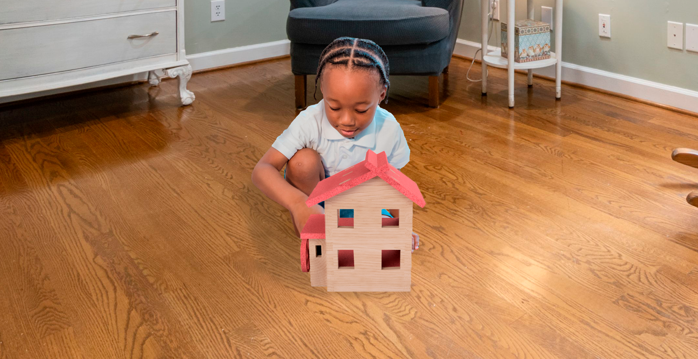
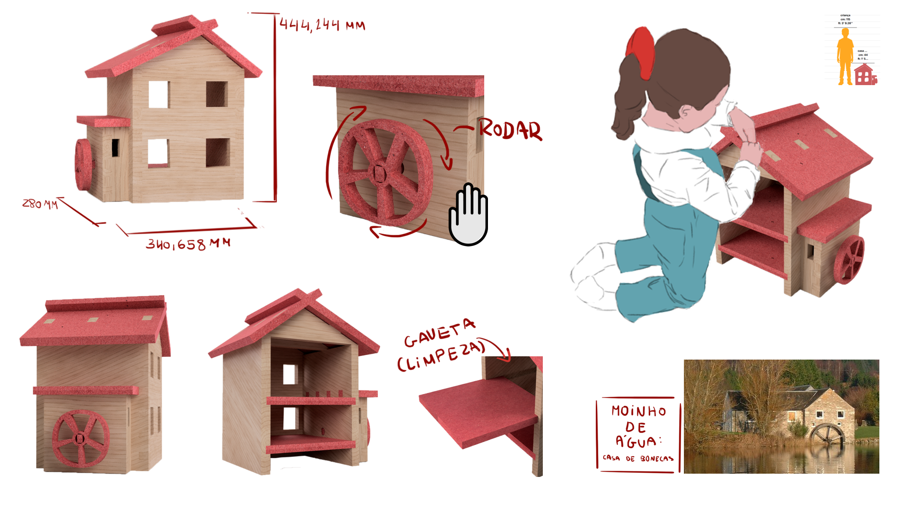
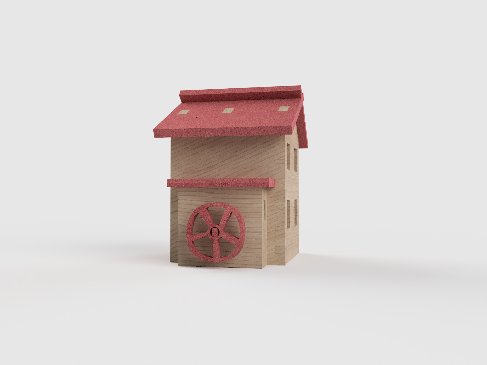
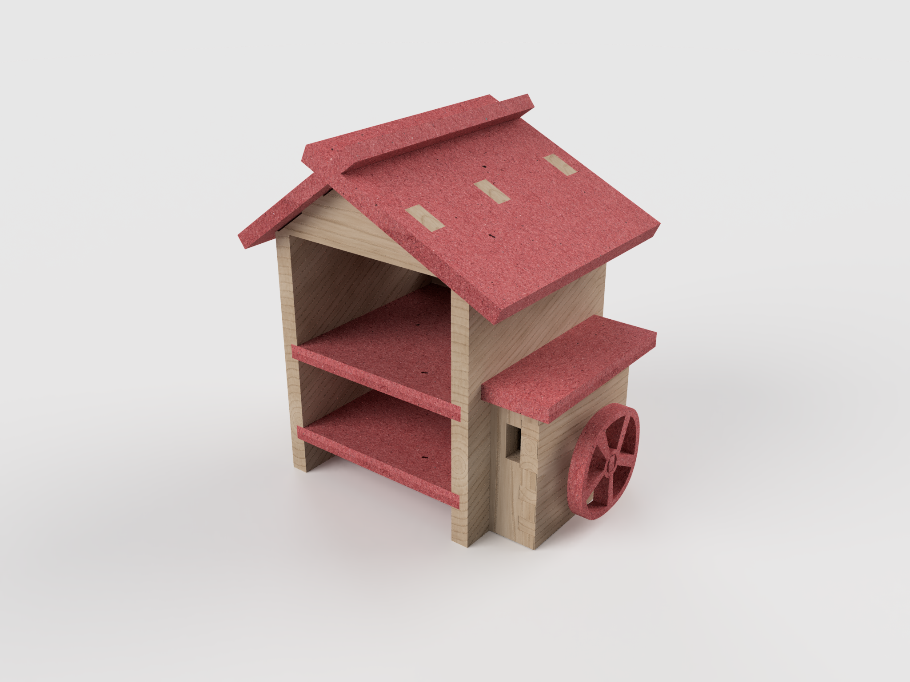
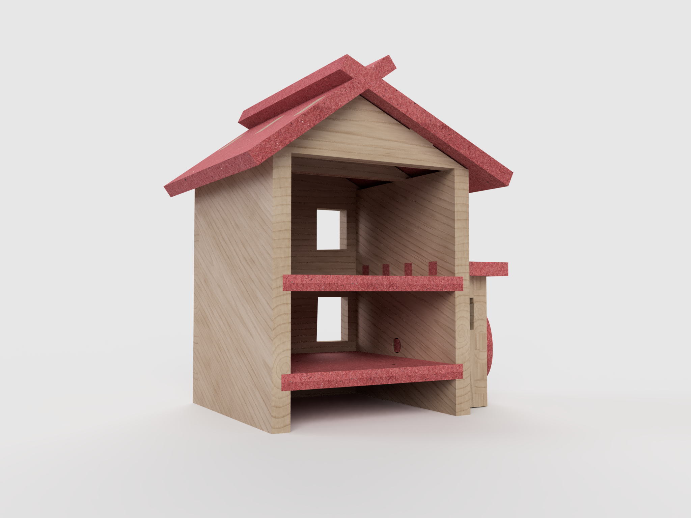

# Moinho de água: Casa de bonecas

<!--
  HERO: idealmente uma pseudo-sessão fotográfica do produto
  (ver tutorial Pletor.ai nos Recursos da disciplina, em
  /Recursos/AI_exps/). Usa attachments/hero.jpg para o frontmatter.
-->

>  Casa de bonecas inspirada num moinho de água para quem adora brincar ao faz de conta

A página deve tornar **visualmente percetível** a estratégia de resposta ao enunciado.
Segue a estrutura de **prancha-resumo** + **esquema-base** (C-E-T-F).

## Conceito

Ideia central do produto. O que é, para quem, porquê.

## Enquadramento

A casa de bonecas foi concebida utilizando os mesmos materiais que os objetos desenhados pelo resto do grupo. Desta forma, o moinho de água tem também as mesmas cores que as restantes peças. A coerência entre brinquedos provém destes dois fatores. Os objetos 1 e 2 foram a base para o design deste brinquedo, combinando a face frontal do objeto 1 e a forma do objeto 2 como um anexo lateral.

## Tecnologia

Materiais (espécie de madeira), processos de fabrico (CNC, laser, impressão 3D), software paramétrico, ficheiros técnicos.

Em concordância com os restantes projetos do grupo foram selecionados três tipos de madeira: faia e vidoeiro, que seriam utilizados de acordo com a sua disponibilidade no local de produção. No entanto faia foi a madeira de referência escolhida para a elaboração deste objeto por ser comum em mobiliário de produção em massa. A medida de referência para a espessura da madeira foi menor espessura de madeira de faia encontrada online, 23 mm.

Todas estas espécies de madeira são seguras para brinquedos. A madeira de faia é fácil de limpar e não se quebra facilmente. Segundo woodlandtrust.org esta madeira muda de cor com o tempo, mas não quebra em lascas que possam magoar uma criança que brinque ccom um brinquedo feito deste material.

Adicionalmente, também de acordo com o coletivo de trabalho, foi utilizado Valchromat, MDF denso e seguro para mobiliário e brinquedos, no tom RED SC com 19 mm de espessura.

Todas as peças da casa de bonecas seriam cortadas numa CNC a partir de restos de madeira da indústria do mobiliário de acordo com o enunciado. Seria utilizada uma fresa de 6mm. A projeção e o modelo 3D deste brinquedo foram realizadas no software Autodesk Fusion 360.

- Modelo 3D: https://a360.co/4372JOg
- Ficheiros: `attachments/`

## Função

Como se brinca, idade-alvo, montagem, conformidade com a Diretiva 2009/48/CE.

O brinquedo Moinho de água: Casa de bonecas tem como público alvo crianças dos 5 aos 9 anos. As possibilidades de brincadeira estão apenas limitadas pela imaginação da criança que utiliza este objeto. Brincar ás casinhas, brincar fingindo que as bonecas são moleiros de outros tempos, girar a roda do moinho... tudo depende da imaginação de quem brinca. Segundo uma colega de educação que fez o seu estágio com crianças, "elas brincam com quase tudo". Segundo a mesma colega partes móveis e elementos que rodam são particularmente apelativos. 

A montagem da casa de bonecas seria realizada em casa por um adulto. As várias peças são demasiado grandes e o objeto demasiado complexo para ser montado por uma criança desta idade sem supervisão. Este brinquedo está de acordo com a Diretiva 2009/48/CE nos artigos relativamente aos materiais utilizados, não-tóxicos e que não se desfazem ou se separam em farpas afiadas, e no artigo relativo à limpeza. Os chão de ambos os pisos da casa está colocado em formato de gaveta para ser fácil de remover e limpar.

## Apresentação

---

## Processo

[Ver processo completo →](processo.md)
